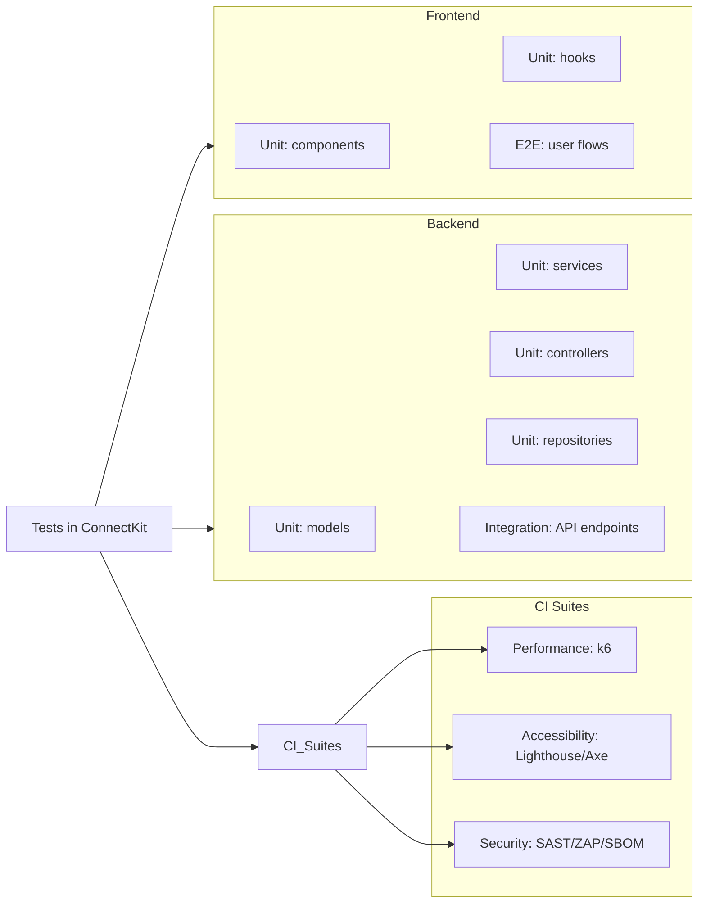

**Test Catalog**

This catalog explains the different kinds of tests in ConnectKit and where to find them. It’s written for non-technical readers to understand what is covered and why it matters.

**Visual Map**

**Why Tests Matter**

- Catch problems early before they reach users
- Keep important features working as the app changes
- Prove performance and security standards are met

**Test Types**

- Unit tests: Check small pieces of code (fast and focused)
- Integration tests: Check how parts work together (API endpoints, data flow)
- End-to-End (E2E) tests: Simulate real user actions in the browser
- Performance tests: Measure speed and behavior under load
- Accessibility checks: Ensure the app is usable by everyone
- Security scans: Look for vulnerabilities in code and dependencies

**Backend (API) Tests**

- Unit tests
  - Location: `backend/src/models/__tests__/` and `backend/src/services/__tests__/` and `backend/src/controllers/__tests__/` and `backend/src/repositories/__tests__/`
  - What they cover: data models, authentication, contact management, controller behavior, repository logic
  - Goal: Prevent bugs in core business logic
- Integration tests
  - Location: `backend/src/tests/integration/`
  - What they cover: API endpoints working together, request/response validation, auth middleware
  - Goal: Verify the API works correctly as a whole

How to run backend tests

- All backend tests: `npm run test --workspace=backend`
- Unit-only (if configured): `npm run test:unit --workspace=backend`
- Integration-only (if configured): `npm run test:integration --workspace=backend`

**Frontend (Web App) Tests**

- Unit tests
  - Location: `frontend/src/components/__tests__/` and `frontend/src/hooks/__tests__/`
  - What they cover: forms, UI components, custom hooks, state logic
  - Goal: Keep user interface behavior reliable
- End-to-End (E2E) tests
  - Location: `frontend/e2e/`
  - What they cover: full user flows like login, registration, password reset
  - Goal: Confirm critical paths work exactly like a real user would see

How to run frontend tests

- Unit tests: `npm run test --workspace=frontend`
- E2E tests (Playwright): `npm run test:e2e --workspace=frontend`

**Performance Tests**

- Location: `tests/performance/k6/`
- Tools: k6 (load, stress, smoke tests)
- What they cover: response times, error rates, system behavior under different loads
- How they run: Primarily via GitHub Actions workflows; results appear as artifacts and Action logs

**Accessibility Checks**

- Where: GitHub Actions workflow runs Lighthouse, Axe, keyboard navigation, and color contrast checks
- Goal: Make the app usable for people with disabilities (screen readers, keyboard-only, etc.)
- Results: See the Accessibility workflow run summary and attached reports (Artifacts)

**Security Scans**

- Where: GitHub Actions workflows for code scanning (SAST), dependency scanning, container scanning, OWASP ZAP, security headers
- Goal: Detect vulnerabilities early and enforce security best practices
- Results: See Security workflows in GitHub Actions; reports are uploaded as artifacts

**Coverage & Reporting**

- Overall testing from the repository root:
  - All tests: `npm test`
  - Coverage (if configured): `npm test -- --coverage`
- CI reports and artifacts are available under GitHub > Actions for each workflow run

**Reading Results**

- Green checks mean tests passed; red X means something failed
- Click into a failed step to see a clear error message
- Download artifacts (reports) from the run’s summary page for details

**Tips**

- Run unit tests locally to get quick feedback
- Use E2E tests to validate user-critical paths before releases
- Check performance and accessibility in CI regularly to prevent regressions
