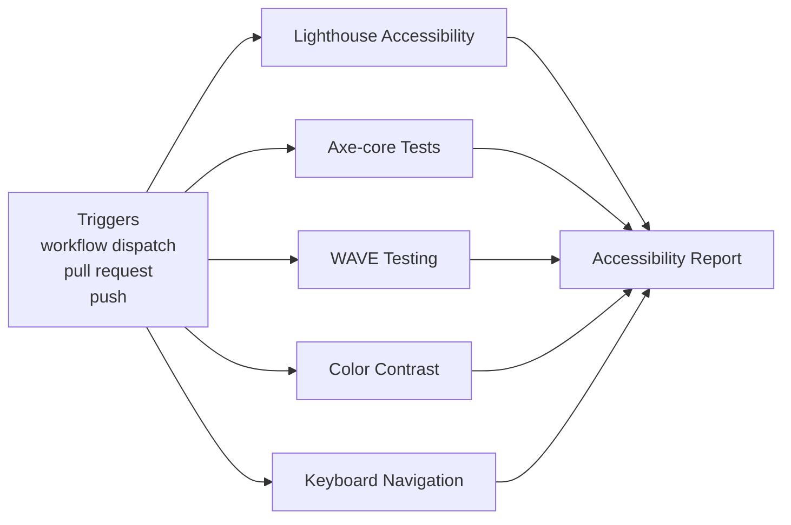
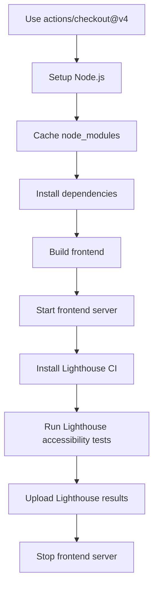
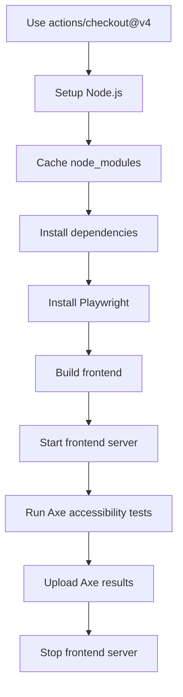
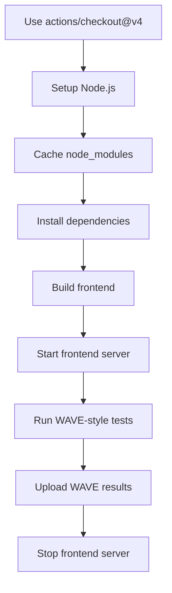
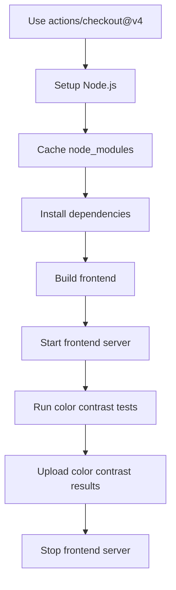
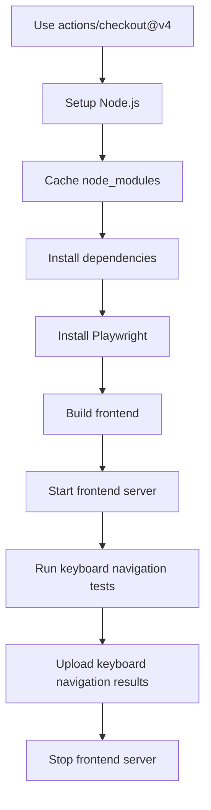
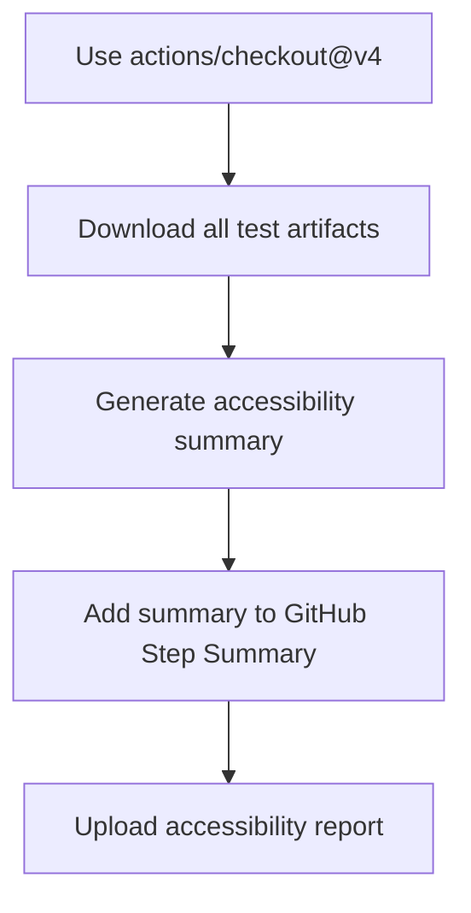

**Accessibility Testing**

**What It Does**

- This workflow helps automate checks for accessibility testing. It runs on specific events and performs a series of steps to validate or analyze your application. You can run it manually from GitHub when needed.

**When It Runs**

- Manually from GitHub (Run workflow)
- On pull request (branches: main, develop)
- On push (branches: main)

**Visual Overview**

**Jobs & Steps**

- Job: Lighthouse Accessibility
  - Runner: ubuntu-latest
  - Depends on: None
  - Artifacts: lighthouse-results-${{ github.run_number }}
  - What happens:
    - Use actions/checkout@v4
    - Setup Node.js
    - Cache node_modules
    - Install dependencies
    - Build frontend
    - Start frontend server
    - Install Lighthouse CI
    - Run Lighthouse accessibility tests
    - Upload Lighthouse results
    - Stop frontend server
- Job: Axe-core Tests
  - Runner: ubuntu-latest
  - Depends on: None
  - Artifacts: axe-results-${{ github.run_number }}
  - What happens:
    - Use actions/checkout@v4
    - Setup Node.js
    - Cache node_modules
    - Install dependencies
    - Install Playwright
    - Build frontend
    - Start frontend server
    - Run Axe accessibility tests
    - Upload Axe results
    - Stop frontend server
- Job: WAVE Testing
  - Runner: ubuntu-latest
  - Depends on: None
  - Artifacts: wave-results-${{ github.run_number }}
  - What happens:
    - Use actions/checkout@v4
    - Setup Node.js
    - Cache node_modules
    - Install dependencies
    - Build frontend
    - Start frontend server
    - Run WAVE-style tests
    - Upload WAVE results
    - Stop frontend server
- Job: Color Contrast
  - Runner: ubuntu-latest
  - Depends on: None
  - Artifacts: color-contrast-results-${{ github.run_number }}
  - What happens:
    - Use actions/checkout@v4
    - Setup Node.js
    - Cache node_modules
    - Install dependencies
    - Build frontend
    - Start frontend server
    - Run color contrast tests
    - Upload color contrast results
    - Stop frontend server
- Job: Keyboard Navigation
  - Runner: ubuntu-latest
  - Depends on: None
  - Artifacts: keyboard-results-${{ github.run_number }}
  - What happens:
    - Use actions/checkout@v4
    - Setup Node.js
    - Cache node_modules
    - Install dependencies
    - Install Playwright
    - Build frontend
    - Start frontend server
    - Run keyboard navigation tests
    - Upload keyboard navigation results
    - Stop frontend server
- Job: Accessibility Report
  - Runner: ubuntu-latest
  - Depends on: Lighthouse A11y, Axe Core Tests, Wave Testing, Color Contrast, Keyboard Navigation
  - Artifacts: accessibility-report-${{ github.run_number }}
  - What happens:
    - Use actions/checkout@v4
    - Download all test artifacts
    - Generate accessibility summary
    - Add summary to GitHub Step Summary
    - Upload accessibility report

**Step Diagrams**
**Lighthouse Accessibility — Steps**

**Axe-core Tests — Steps**

**WAVE Testing — Steps**

**Color Contrast — Steps**

**Keyboard Navigation — Steps**

**Accessibility Report — Steps**

**Required Secrets**

- None

**How To Run Manually**

- Go to your repository on GitHub
- Click the Actions tab
- Select "Accessibility Testing" from the left sidebar
- Click the Run workflow button and follow prompts

**Where To See Results**

- Action run summary shows job status and logs
- Artifacts section provides downloadable reports (if any)
- Annotations highlight warnings and errors in code

**Troubleshooting Tips**

- If a step fails, open the step log to see details
- Ensure required secrets exist under Settings > Secrets and variables > Actions
- Check that referenced paths and scripts exist in the repo
