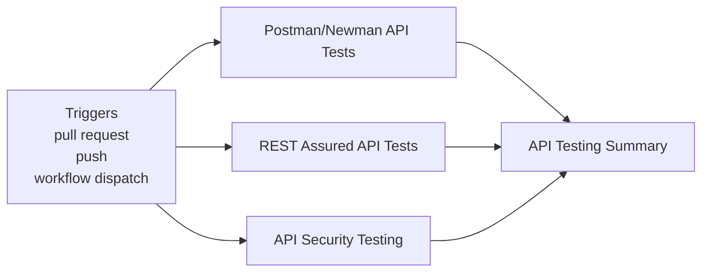
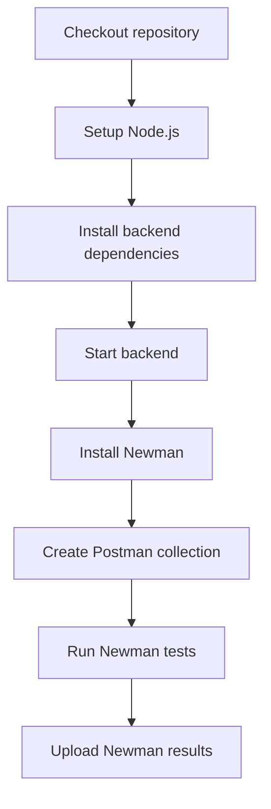
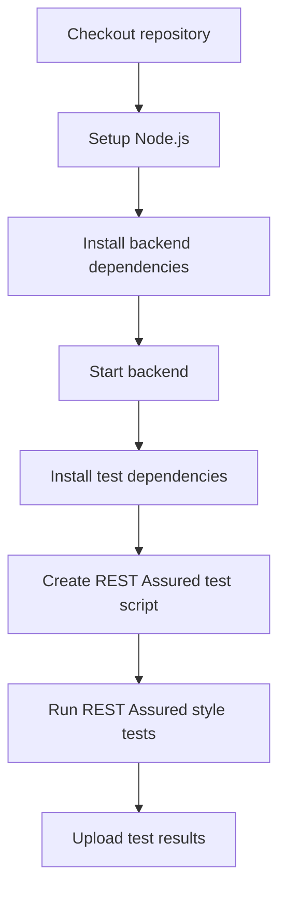
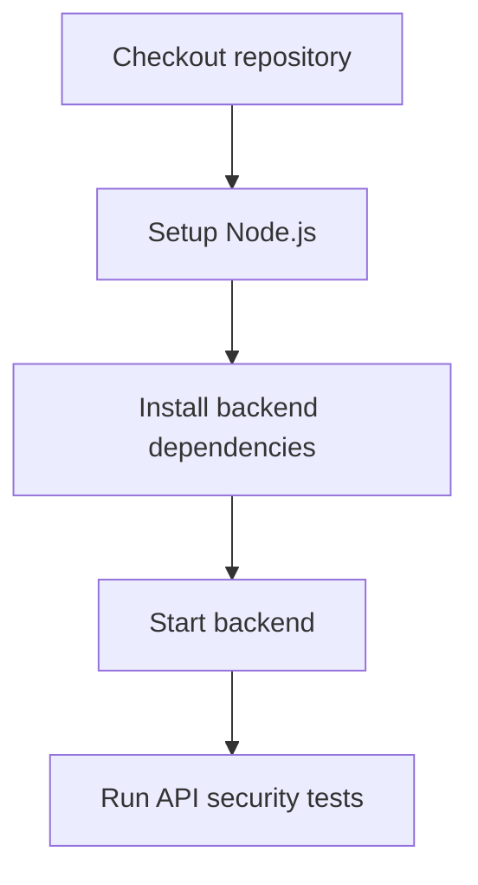
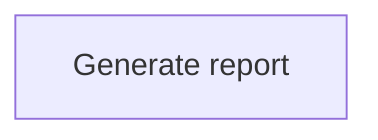

**API Testing**

**What It Does**

- This workflow helps automate checks for api testing. It runs on specific events and performs a series of steps to validate or analyze your application. You can run it manually from GitHub when needed.

**When It Runs**

- On pull request (branches: main, develop)
- On push (branches: main)
- Manually from GitHub (Run workflow)

**Visual Overview**

**Jobs & Steps**

- Job: Postman/Newman API Tests
  - Runner: ubuntu-latest
  - Depends on: None
  - Artifacts: newman-results-${{ github.run_number }}
  - What happens:
    - Checkout repository
    - Setup Node.js
    - Install backend dependencies
    - Start backend
    - Install Newman
    - Create Postman collection
    - Run Newman tests
    - Upload Newman results
- Job: REST Assured API Tests
  - Runner: ubuntu-latest
  - Depends on: None
  - Artifacts: rest-assured-results-${{ github.run_number }}
  - What happens:
    - Checkout repository
    - Setup Node.js
    - Install backend dependencies
    - Start backend
    - Install test dependencies
    - Create REST Assured test script
    - Run REST Assured style tests
    - Upload test results
- Job: API Security Testing
  - Runner: ubuntu-latest
  - Depends on: None
  - What happens:
    - Checkout repository
    - Setup Node.js
    - Install backend dependencies
    - Start backend
    - Run API security tests
- Job: API Testing Summary
  - Runner: ubuntu-latest
  - Depends on: Postman Newman Tests, Rest Assured Tests, Api Security Tests
  - What happens:
    - Generate report

**Step Diagrams**
**Postman/Newman API Tests — Steps**

**REST Assured API Tests — Steps**

**API Security Testing — Steps**

**API Testing Summary — Steps**

**Required Secrets**

- None

**How To Run Manually**

- Go to your repository on GitHub
- Click the Actions tab
- Select "API Testing" from the left sidebar
- Click the Run workflow button and follow prompts

**Where To See Results**

- Action run summary shows job status and logs
- Artifacts section provides downloadable reports (if any)
- Annotations highlight warnings and errors in code

**Troubleshooting Tips**

- If a step fails, open the step log to see details
- Ensure required secrets exist under Settings > Secrets and variables > Actions
- Check that referenced paths and scripts exist in the repo
