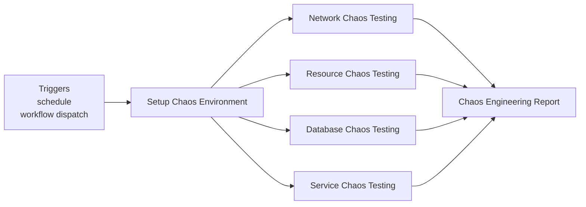
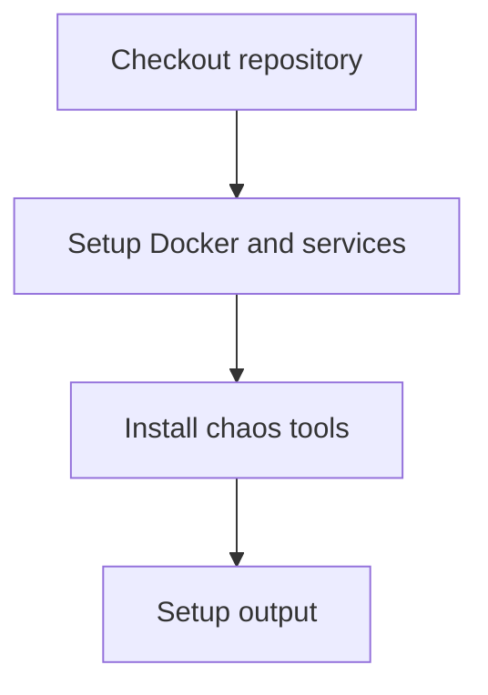
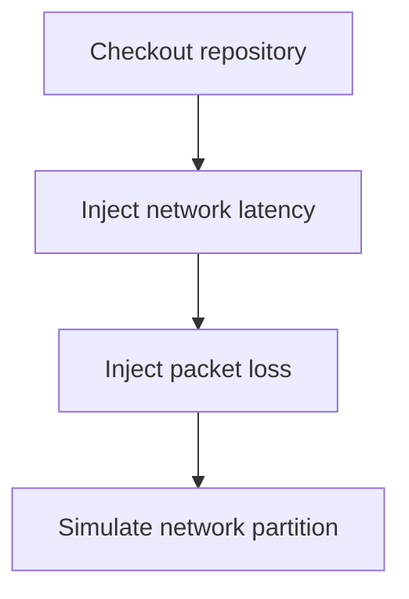
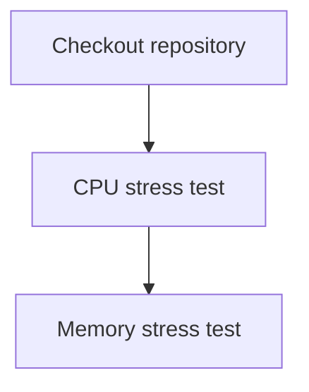
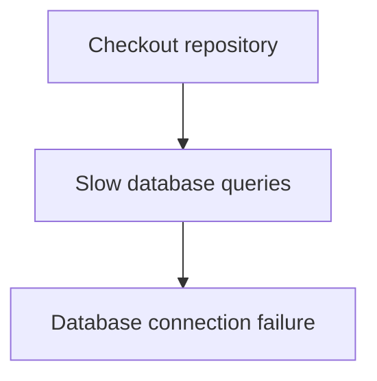
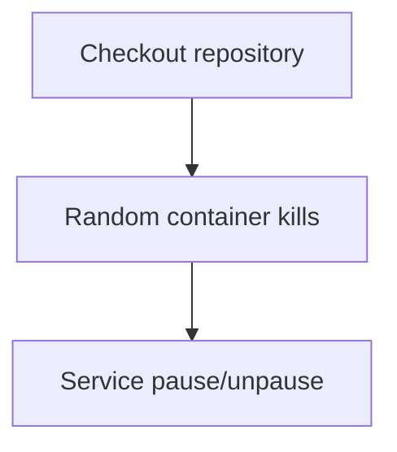
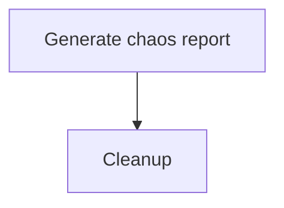

**Chaos Engineering**

**What It Does**

- This workflow helps automate checks for chaos engineering. It runs on specific events and performs a series of steps to validate or analyze your application. You can run it manually from GitHub when needed.

**When It Runs**

- On schedule (cron: 0 3 \* \* 1)
- Manually from GitHub (Run workflow)

**Visual Overview**

**Jobs & Steps**

- Job: Setup Chaos Environment
  - Runner: ubuntu-latest
  - Depends on: None
  - What happens:
    - Checkout repository
    - Setup Docker and services
    - Install chaos tools
    - Setup output
- Job: Network Chaos Testing
  - Runner: ubuntu-latest
  - Depends on: Setup Chaos Environment
  - What happens:
    - Checkout repository
    - Inject network latency
    - Inject packet loss
    - Simulate network partition
- Job: Resource Chaos Testing
  - Runner: ubuntu-latest
  - Depends on: Setup Chaos Environment
  - What happens:
    - Checkout repository
    - CPU stress test
    - Memory stress test
- Job: Database Chaos Testing
  - Runner: ubuntu-latest
  - Depends on: Setup Chaos Environment
  - What happens:
    - Checkout repository
    - Slow database queries
    - Database connection failure
- Job: Service Chaos Testing
  - Runner: ubuntu-latest
  - Depends on: Setup Chaos Environment
  - What happens:
    - Checkout repository
    - Random container kills
    - Service pause/unpause
- Job: Chaos Engineering Report
  - Runner: ubuntu-latest
  - Depends on: Network Chaos, Resource Chaos, Database Chaos, Service Chaos
  - What happens:
    - Generate chaos report
    - Cleanup

**Step Diagrams**
**Setup Chaos Environment — Steps**

**Network Chaos Testing — Steps**

**Resource Chaos Testing — Steps**

**Database Chaos Testing — Steps**

**Service Chaos Testing — Steps**

**Chaos Engineering Report — Steps**

**Required Secrets**

- None

**How To Run Manually**

- Go to your repository on GitHub
- Click the Actions tab
- Select "Chaos Engineering" from the left sidebar
- Click the Run workflow button and follow prompts

**Where To See Results**

- Action run summary shows job status and logs
- Artifacts section provides downloadable reports (if any)
- Annotations highlight warnings and errors in code

**Troubleshooting Tips**

- If a step fails, open the step log to see details
- Ensure required secrets exist under Settings > Secrets and variables > Actions
- Check that referenced paths and scripts exist in the repo
