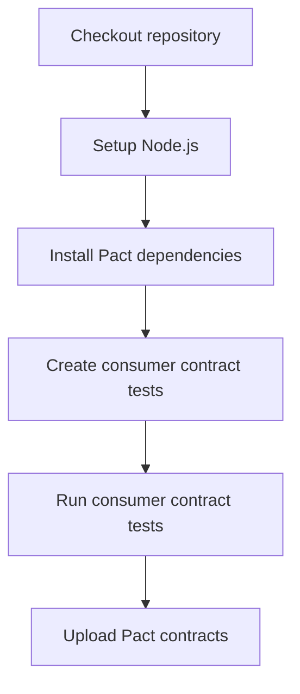
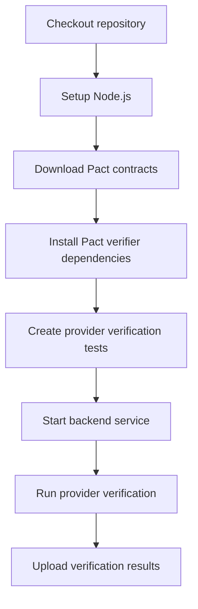
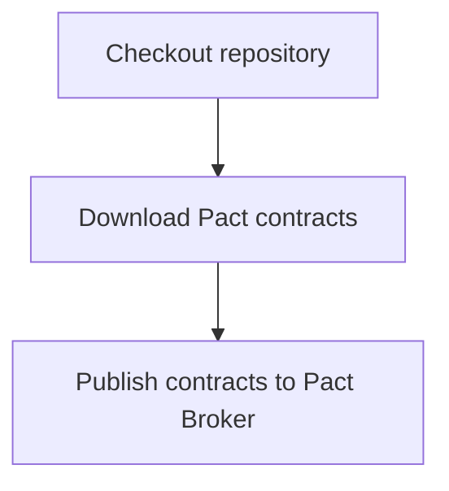

**Contract Testing**

**What It Does**

- This workflow helps automate checks for contract testing. It runs on specific events and performs a series of steps to validate or analyze your application. You can run it manually from GitHub when needed.

**When It Runs**

- On pull request (branches: main, develop)
- On push (branches: main)
- Manually from GitHub (Run workflow)

**Visual Overview**

```mermaid
flowchart LR
  T[Triggers\npull request\npush\nworkflow dispatch]
  J_consumer_tests[Consumer Contract Tests (Frontend)]
  J_provider_verification[Provider Contract Verification (Backend)]
  J_pact_broker_publish[Publish to Pact Broker]
  T --> J_consumer_tests
  J_consumer_tests --> J_provider_verification
  J_consumer_tests --> J_pact_broker_publish
  J_provider_verification --> J_pact_broker_publish
```

**Jobs & Steps**

- Job: Consumer Contract Tests (Frontend)
  - Runner: ubuntu-latest
  - Depends on: None
  - Artifacts: pact-contracts-${{ github.run_number }}
  - What happens:
    - Checkout repository
    - Setup Node.js
    - Install Pact dependencies
    - Create consumer contract tests
    - Run consumer contract tests
    - Upload Pact contracts
- Job: Provider Contract Verification (Backend)
  - Runner: ubuntu-latest
  - Depends on: Consumer Tests
  - Artifacts: pact-verification-results-${{ github.run_number }}
  - What happens:
    - Checkout repository
    - Setup Node.js
    - Download Pact contracts
    - Install Pact verifier dependencies
    - Create provider verification tests
    - Start backend service
    - Run provider verification
    - Upload verification results
- Job: Publish to Pact Broker
  - Runner: ubuntu-latest
  - Depends on: Consumer Tests, Provider Verification
  - What happens:
    - Checkout repository
    - Download Pact contracts
    - Publish contracts to Pact Broker

**Step Diagrams**
**Consumer Contract Tests (Frontend) — Steps**



**Provider Contract Verification (Backend) — Steps**



**Publish to Pact Broker — Steps**



**Required Secrets**

- None

**How To Run Manually**

- Go to your repository on GitHub
- Click the Actions tab
- Select "Contract Testing" from the left sidebar
- Click the Run workflow button and follow prompts

**Where To See Results**

- Action run summary shows job status and logs
- Artifacts section provides downloadable reports (if any)
- Annotations highlight warnings and errors in code

**Troubleshooting Tips**

- If a step fails, open the step log to see details
- Ensure required secrets exist under Settings > Secrets and variables > Actions
- Check that referenced paths and scripts exist in the repo
