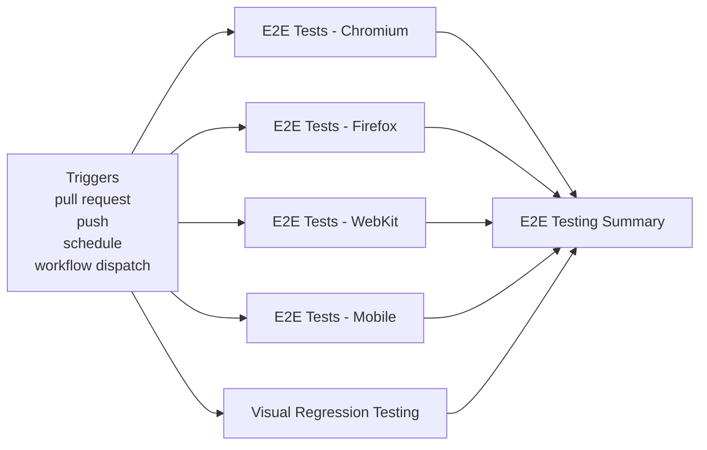
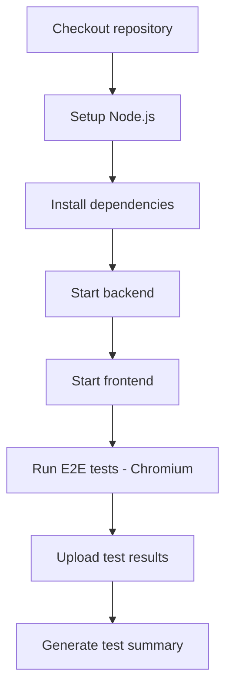
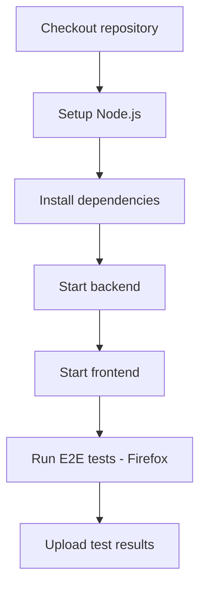
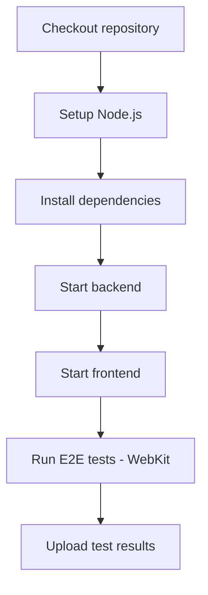
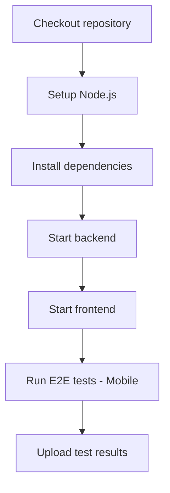
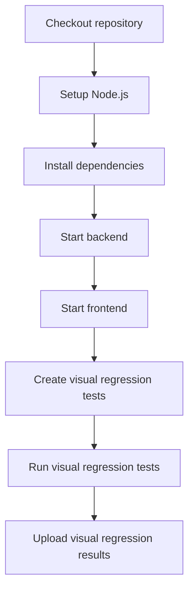
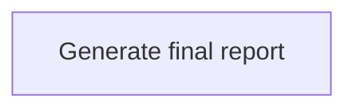

**E2E Testing**

**What It Does**

- This workflow helps automate checks for e2e testing. It runs on specific events and performs a series of steps to validate or analyze your application. You can run it manually from GitHub when needed.

**When It Runs**

- On pull request (branches: main, develop)
- On push (branches: main)
- On schedule (cron: 0 4 \* \* \*)
- Manually from GitHub (Run workflow)

**Visual Overview**

**Jobs & Steps**

- Job: E2E Tests - Chromium
  - Runner: ubuntu-latest
  - Depends on: None
  - Artifacts: e2e-chromium-results-${{ github.run_number }}
  - What happens:
    - Checkout repository
    - Setup Node.js
    - Install dependencies
    - Start backend
    - Start frontend
    - Run E2E tests - Chromium
    - Upload test results
    - Generate test summary
- Job: E2E Tests - Firefox
  - Runner: ubuntu-latest
  - Depends on: None
  - Artifacts: e2e-firefox-results-${{ github.run_number }}
  - What happens:
    - Checkout repository
    - Setup Node.js
    - Install dependencies
    - Start backend
    - Start frontend
    - Run E2E tests - Firefox
    - Upload test results
- Job: E2E Tests - WebKit
  - Runner: ubuntu-latest
  - Depends on: None
  - Artifacts: e2e-webkit-results-${{ github.run_number }}
  - What happens:
    - Checkout repository
    - Setup Node.js
    - Install dependencies
    - Start backend
    - Start frontend
    - Run E2E tests - WebKit
    - Upload test results
- Job: E2E Tests - Mobile
  - Runner: ubuntu-latest
  - Depends on: None
  - Artifacts: e2e-mobile-results-${{ github.run_number }}
  - What happens:
    - Checkout repository
    - Setup Node.js
    - Install dependencies
    - Start backend
    - Start frontend
    - Run E2E tests - Mobile
    - Upload test results
- Job: Visual Regression Testing
  - Runner: ubuntu-latest
  - Depends on: None
  - Artifacts: visual-regression-results-${{ github.run_number }}
  - What happens:
    - Checkout repository
    - Setup Node.js
    - Install dependencies
    - Start backend
    - Start frontend
    - Create visual regression tests
    - Run visual regression tests
    - Upload visual regression results
- Job: E2E Testing Summary
  - Runner: ubuntu-latest
  - Depends on: E2e Chromium, E2e Firefox, E2e Webkit, E2e Mobile, Visual Regression
  - What happens:
    - Generate final report

**Step Diagrams**
**E2E Tests - Chromium — Steps**

**E2E Tests - Firefox — Steps**

**E2E Tests - WebKit — Steps**

**E2E Tests - Mobile — Steps**

**Visual Regression Testing — Steps**

**E2E Testing Summary — Steps**

**Required Secrets**

- None

**How To Run Manually**

- Go to your repository on GitHub
- Click the Actions tab
- Select "E2E Testing" from the left sidebar
- Click the Run workflow button and follow prompts

**Where To See Results**

- Action run summary shows job status and logs
- Artifacts section provides downloadable reports (if any)
- Annotations highlight warnings and errors in code

**Troubleshooting Tips**

- If a step fails, open the step log to see details
- Ensure required secrets exist under Settings > Secrets and variables > Actions
- Check that referenced paths and scripts exist in the repo
