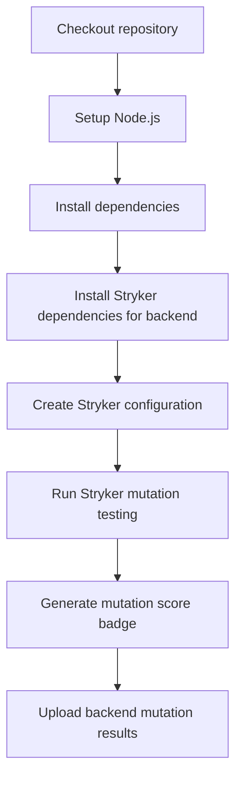
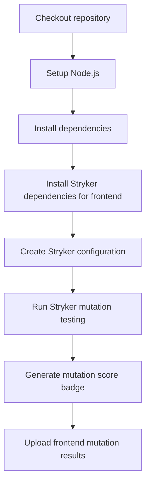
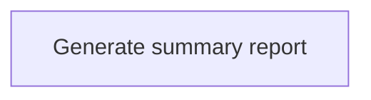

**Mutation Testing**

**What It Does**

- This workflow helps automate checks for mutation testing. It runs on specific events and performs a series of steps to validate or analyze your application. You can run it manually from GitHub when needed.

**When It Runs**

- On pull request (branches: main, develop)
- On schedule (cron: 0 5 \* \* 0)
- Manually from GitHub (Run workflow)

**Visual Overview**

```mermaid
flowchart LR
  T[Triggers\npull request\nschedule\nworkflow dispatch]
  J_backend_mutation_testing[Backend Mutation Testing (Stryker)]
  J_frontend_mutation_testing[Frontend Mutation Testing (Stryker)]
  J_summary[Mutation Testing Summary]
  T --> J_backend_mutation_testing
  T --> J_frontend_mutation_testing
  J_backend_mutation_testing --> J_summary
  J_frontend_mutation_testing --> J_summary
```

**Jobs & Steps**

- Job: Backend Mutation Testing (Stryker)
  - Runner: ubuntu-latest
  - Depends on: None
  - Artifacts: backend-mutation-results-${{ github.run_number }}
  - What happens:
    - Checkout repository
    - Setup Node.js
    - Install dependencies
    - Install Stryker dependencies for backend
    - Create Stryker configuration
    - Run Stryker mutation testing
    - Generate mutation score badge
    - Upload backend mutation results
- Job: Frontend Mutation Testing (Stryker)
  - Runner: ubuntu-latest
  - Depends on: None
  - Artifacts: frontend-mutation-results-${{ github.run_number }}
  - What happens:
    - Checkout repository
    - Setup Node.js
    - Install dependencies
    - Install Stryker dependencies for frontend
    - Create Stryker configuration
    - Run Stryker mutation testing
    - Generate mutation score badge
    - Upload frontend mutation results
- Job: Mutation Testing Summary
  - Runner: ubuntu-latest
  - Depends on: Backend Mutation Testing, Frontend Mutation Testing
  - What happens:
    - Generate summary report

**Step Diagrams**
**Backend Mutation Testing (Stryker) — Steps**



**Frontend Mutation Testing (Stryker) — Steps**



**Mutation Testing Summary — Steps**



**Required Secrets**

- None

**How To Run Manually**

- Go to your repository on GitHub
- Click the Actions tab
- Select "Mutation Testing" from the left sidebar
- Click the Run workflow button and follow prompts

**Where To See Results**

- Action run summary shows job status and logs
- Artifacts section provides downloadable reports (if any)
- Annotations highlight warnings and errors in code

**Troubleshooting Tips**

- If a step fails, open the step log to see details
- Ensure required secrets exist under Settings > Secrets and variables > Actions
- Check that referenced paths and scripts exist in the repo
