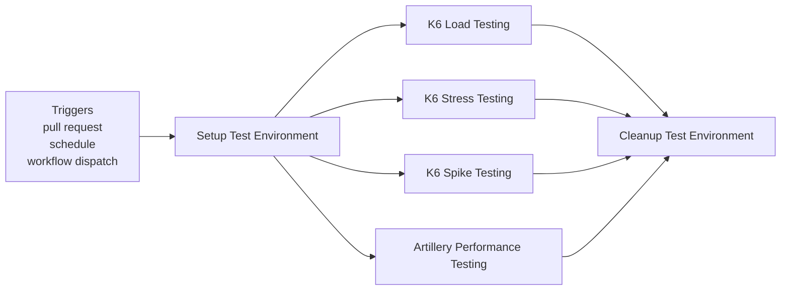
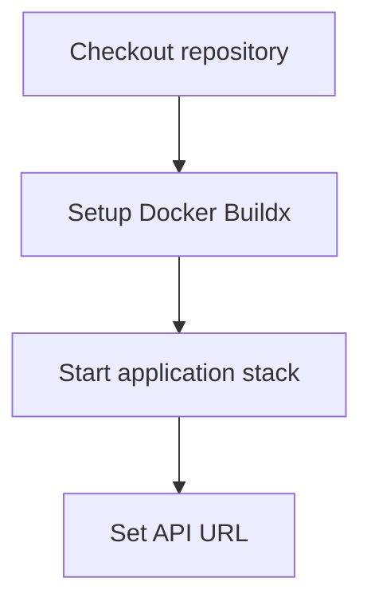
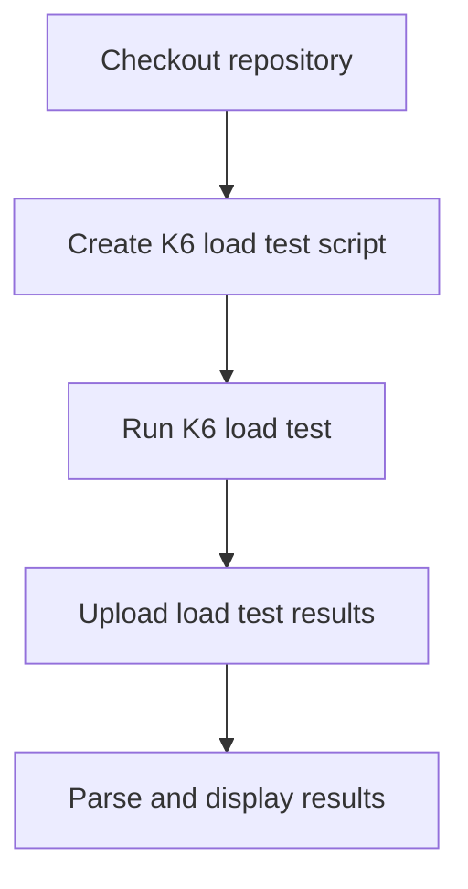
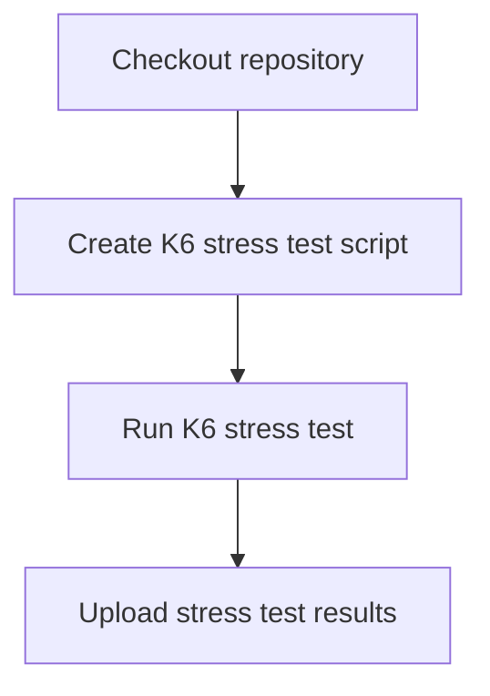
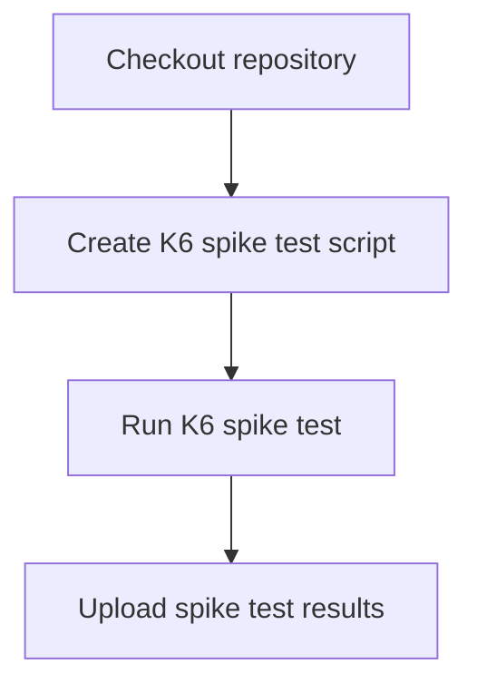
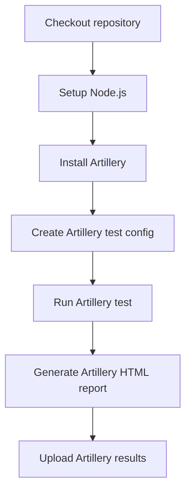
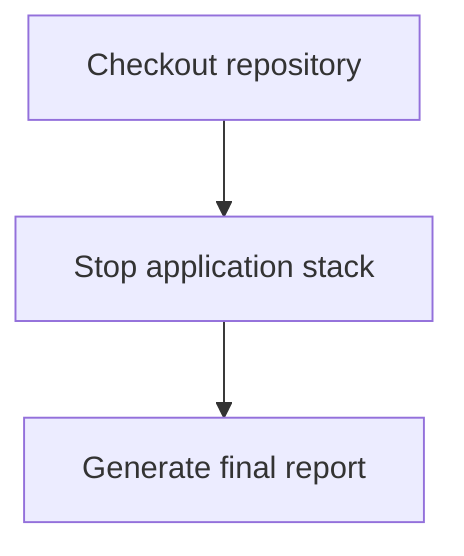

**Performance Testing**

**What It Does**

- This workflow helps automate checks for performance testing. It runs on specific events and performs a series of steps to validate or analyze your application. You can run it manually from GitHub when needed.

**When It Runs**

- On pull request (branches: main, develop)
- On schedule (cron: 0 2 \* \* \*)
- Manually from GitHub (Run workflow)

**Visual Overview**

**Jobs & Steps**

- Job: Setup Test Environment
  - Runner: ubuntu-latest
  - Depends on: None
  - What happens:
    - Checkout repository
    - Setup Docker Buildx
    - Start application stack
    - Set API URL
- Job: K6 Load Testing
  - Runner: ubuntu-latest
  - Depends on: Setup
  - Artifacts: k6-load-test-results-${{ github.run_number }}
  - What happens:
    - Checkout repository
    - Create K6 load test script
    - Run K6 load test
    - Upload load test results
    - Parse and display results
- Job: K6 Stress Testing
  - Runner: ubuntu-latest
  - Depends on: Setup
  - Artifacts: k6-stress-test-results-${{ github.run_number }}
  - What happens:
    - Checkout repository
    - Create K6 stress test script
    - Run K6 stress test
    - Upload stress test results
- Job: K6 Spike Testing
  - Runner: ubuntu-latest
  - Depends on: Setup
  - Artifacts: k6-spike-test-results-${{ github.run_number }}
  - What happens:
    - Checkout repository
    - Create K6 spike test script
    - Run K6 spike test
    - Upload spike test results
- Job: Artillery Performance Testing
  - Runner: ubuntu-latest
  - Depends on: Setup
  - Artifacts: artillery-results-${{ github.run_number }}
  - What happens:
    - Checkout repository
    - Setup Node.js
    - Install Artillery
    - Create Artillery test config
    - Run Artillery test
    - Generate Artillery HTML report
    - Upload Artillery results
- Job: Cleanup Test Environment
  - Runner: ubuntu-latest
  - Depends on: K6 Load Testing, K6 Stress Testing, K6 Spike Testing, Artillery Testing
  - What happens:
    - Checkout repository
    - Stop application stack
    - Generate final report

**Step Diagrams**
**Setup Test Environment — Steps**

**K6 Load Testing — Steps**

**K6 Stress Testing — Steps**

**K6 Spike Testing — Steps**

**Artillery Performance Testing — Steps**

**Cleanup Test Environment — Steps**

**Required Secrets**

- None

**How To Run Manually**

- Go to your repository on GitHub
- Click the Actions tab
- Select "Performance Testing" from the left sidebar
- Click the Run workflow button and follow prompts

**Where To See Results**

- Action run summary shows job status and logs
- Artifacts section provides downloadable reports (if any)
- Annotations highlight warnings and errors in code

**Troubleshooting Tips**

- If a step fails, open the step log to see details
- Ensure required secrets exist under Settings > Secrets and variables > Actions
- Check that referenced paths and scripts exist in the repo
