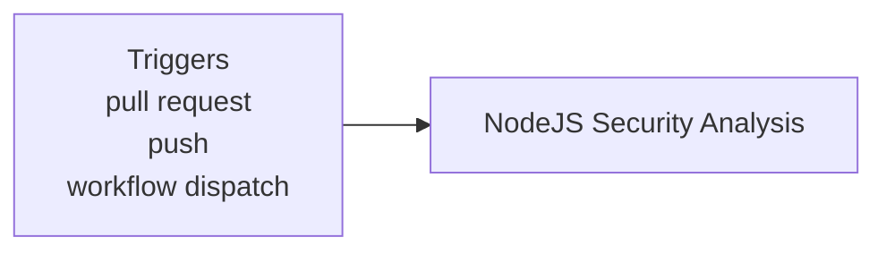
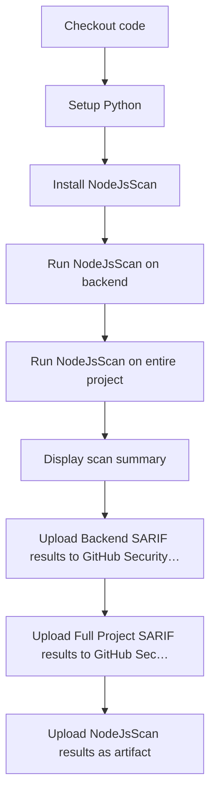

**SAST - NodeJS Security Scan**

**What It Does**

- This workflow helps automate checks for sast - nodejs security scan. It runs on specific events and performs a series of steps to validate or analyze your application. You can run it manually from GitHub when needed.

**When It Runs**

- On pull request (branches: main, develop)
- On push (branches: main)
- Manually from GitHub (Run workflow)

**Visual Overview**

**Jobs & Steps**

- Job: NodeJS Security Analysis
  - Runner: ubuntu-latest
  - Depends on: None
  - Artifacts: nodejs-security-results
  - What happens:
    - Checkout code
    - Setup Python
    - Install NodeJsScan
    - Run NodeJsScan on backend
    - Run NodeJsScan on entire project
    - Display scan summary
    - Upload Backend SARIF results to GitHub Security Dashboard
    - Upload Full Project SARIF results to GitHub Security Dashboard
    - Upload NodeJsScan results as artifact

**Step Diagrams**
**NodeJS Security Analysis — Steps**

**Required Secrets**

- None

**How To Run Manually**

- Go to your repository on GitHub
- Click the Actions tab
- Select "SAST - NodeJS Security Scan" from the left sidebar
- Click the Run workflow button and follow prompts

**Where To See Results**

- Action run summary shows job status and logs
- Artifacts section provides downloadable reports (if any)
- Annotations highlight warnings and errors in code

**Troubleshooting Tips**

- If a step fails, open the step log to see details
- Ensure required secrets exist under Settings > Secrets and variables > Actions
- Check that referenced paths and scripts exist in the repo
