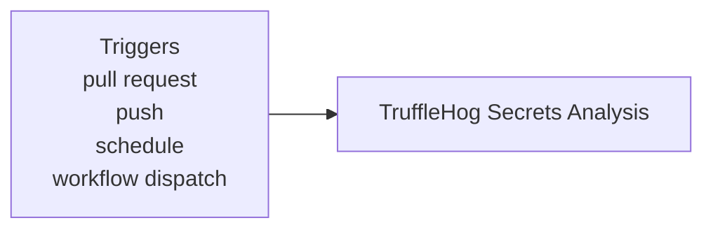
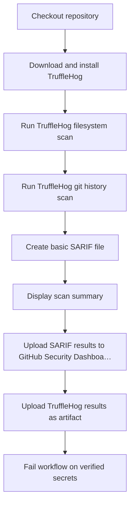

**SAST - TruffleHog Secrets Scan**

**What It Does**

- This workflow helps automate checks for sast - trufflehog secrets scan. It runs on specific events and performs a series of steps to validate or analyze your application. You can run it manually from GitHub when needed.

**When It Runs**

- On pull request (branches: main, develop)
- On push (branches: main)
- On schedule (cron: 0 3 \* \* \*)
- Manually from GitHub (Run workflow)

**Visual Overview**

**Jobs & Steps**

- Job: TruffleHog Secrets Analysis
  - Runner: ubuntu-latest
  - Depends on: None
  - Artifacts: trufflehog-secrets-results
  - What happens:
    - Checkout repository
    - Download and install TruffleHog
    - Run TruffleHog filesystem scan
    - Run TruffleHog git history scan
    - Create basic SARIF file
    - Display scan summary
    - Upload SARIF results to GitHub Security Dashboard
    - Upload TruffleHog results as artifact
    - Fail workflow on verified secrets

**Step Diagrams**
**TruffleHog Secrets Analysis — Steps**

**Required Secrets**

- json

**How To Run Manually**

- Go to your repository on GitHub
- Click the Actions tab
- Select "SAST - TruffleHog Secrets Scan" from the left sidebar
- Click the Run workflow button and follow prompts

**Where To See Results**

- Action run summary shows job status and logs
- Artifacts section provides downloadable reports (if any)
- Annotations highlight warnings and errors in code

**Troubleshooting Tips**

- If a step fails, open the step log to see details
- Ensure required secrets exist under Settings > Secrets and variables > Actions
- Check that referenced paths and scripts exist in the repo
