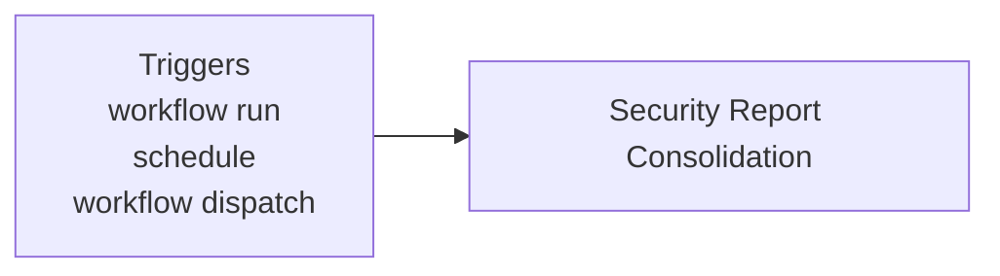
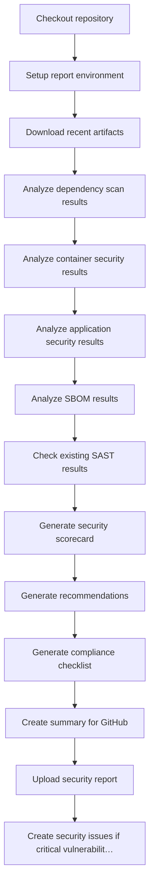

**Security - Consolidated Report**

**What It Does**

- This workflow helps automate checks for security - consolidated report. It runs on specific events and performs a series of steps to validate or analyze your application. You can run it manually from GitHub when needed.

**When It Runs**

- On workflow_run
- On schedule (cron: 0 6 \* \* 1)
- Manually from GitHub (Run workflow)

**Visual Overview**

**Jobs & Steps**

- Job: Security Report Consolidation
  - Runner: ubuntu-latest
  - Depends on: None
  - Artifacts: security-report-consolidated-${{ github.run_number }}
  - What happens:
    - Checkout repository
    - Setup report environment
    - Download recent artifacts
    - Analyze dependency scan results
    - Analyze container security results
    - Analyze application security results
    - Analyze SBOM results
    - Check existing SAST results
    - Generate security scorecard
    - Generate recommendations
    - Generate compliance checklist
    - Create summary for GitHub
    - Upload security report
    - Create security issues if critical vulnerabilities found

**Step Diagrams**
**Security Report Consolidation — Steps**

**Required Secrets**

- None

**How To Run Manually**

- Go to your repository on GitHub
- Click the Actions tab
- Select "Security - Consolidated Report" from the left sidebar
- Click the Run workflow button and follow prompts

**Where To See Results**

- Action run summary shows job status and logs
- Artifacts section provides downloadable reports (if any)
- Annotations highlight warnings and errors in code

**Troubleshooting Tips**

- If a step fails, open the step log to see details
- Ensure required secrets exist under Settings > Secrets and variables > Actions
- Check that referenced paths and scripts exist in the repo
