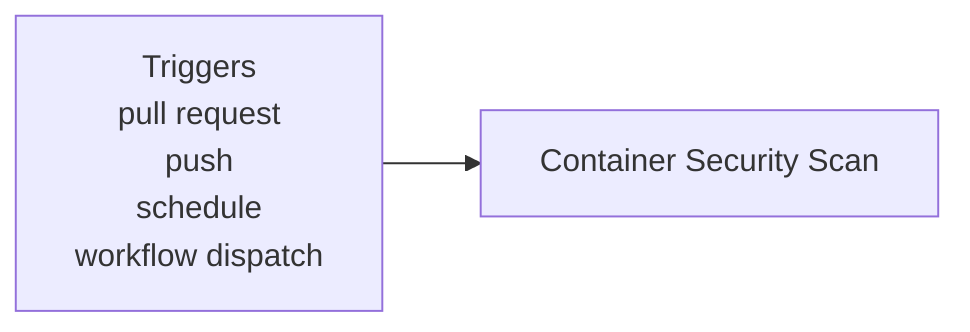

**Security - Container Scanning**

**What It Does**

- This workflow helps automate checks for security - container scanning. It runs on specific events and performs a series of steps to validate or analyze your application. You can run it manually from GitHub when needed.

**When It Runs**

- On pull request
- On push (branches: main)
- On schedule (cron: 0 3 \* \* \*)
- Manually from GitHub (Run workflow)

**Visual Overview**



**Jobs & Steps**

- Job: Container Security Scan
  - Runner: ubuntu-latest
  - Depends on: None
  - Artifacts: container-security-${{ matrix.service }}-${{ github.run_number }}
  - What happens:
    - Checkout repository
    - Set up Docker Buildx
    - Build Docker image (${{ matrix.service }})
    - Run Trivy vulnerability scanner
    - Run Trivy scanner (Table format)
    - Install Syft and Grype
    - Generate container SBOM
    - Run Grype vulnerability scanner
    - Analyze Docker configuration
    - Check base image security
    - Generate vulnerability summary
    - Upload scan results and SBOMs

**Step Diagrams**
**Container Security Scan — Steps**

```mermaid
flowchart TB
  S_container_security_0[Checkout repository]
  S_container_security_1[Set up Docker Buildx]
  S_container_security_0 --> S_container_security_1
  S_container_security_2[Build Docker image (${{ matrix.service }})]
  S_container_security_1 --> S_container_security_2
  S_container_security_3[Run Trivy vulnerability scanner]
  S_container_security_2 --> S_container_security_3
  S_container_security_4[Run Trivy scanner (Table format)]
  S_container_security_3 --> S_container_security_4
  S_container_security_5[Install Syft and Grype]
  S_container_security_4 --> S_container_security_5
  S_container_security_6[Generate container SBOM]
  S_container_security_5 --> S_container_security_6
  S_container_security_7[Run Grype vulnerability scanner]
  S_container_security_6 --> S_container_security_7
  S_container_security_8[Analyze Docker configuration]
  S_container_security_7 --> S_container_security_8
  S_container_security_9[Check base image security]
  S_container_security_8 --> S_container_security_9
  S_container_security_10[Generate vulnerability summary]
  S_container_security_9 --> S_container_security_10
  S_container_security_11[Upload scan results and SBOMs]
  S_container_security_10 --> S_container_security_11
```

**Required Secrets**

- None

**How To Run Manually**

- Go to your repository on GitHub
- Click the Actions tab
- Select "Security - Container Scanning" from the left sidebar
- Click the Run workflow button and follow prompts

**Where To See Results**

- Action run summary shows job status and logs
- Artifacts section provides downloadable reports (if any)
- Annotations highlight warnings and errors in code

**Troubleshooting Tips**

- If a step fails, open the step log to see details
- Ensure required secrets exist under Settings > Secrets and variables > Actions
- Check that referenced paths and scripts exist in the repo
