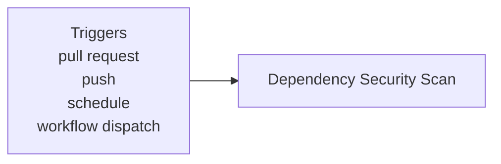

**Security - Dependency Scanning**

**What It Does**

- This workflow helps automate checks for security - dependency scanning. It runs on specific events and performs a series of steps to validate or analyze your application. You can run it manually from GitHub when needed.

**When It Runs**

- On pull request (branches: main, develop)
- On push (branches: main)
- On schedule (cron: 0 2 \* \* \*)
- Manually from GitHub (Run workflow)

**Visual Overview**



**Jobs & Steps**

- Job: Dependency Security Scan
  - Runner: ubuntu-latest
  - Depends on: None
  - Artifacts: dependency-scan-results-${{ github.run_number }}
  - What happens:
    - Checkout repository
    - Setup Node.js
    - Install workspace dependencies
    - Run npm audit (Frontend)
    - Run npm audit (Backend)
    - Generate SBOM for dependencies
    - Check for outdated packages
    - Upload dependency scan results and SBOMs
    - Enforce security policy

**Step Diagrams**
**Dependency Security Scan — Steps**

```mermaid
flowchart TB
  S_dependency_scan_0[Checkout repository]
  S_dependency_scan_1[Setup Node.js]
  S_dependency_scan_0 --> S_dependency_scan_1
  S_dependency_scan_2[Install workspace dependencies]
  S_dependency_scan_1 --> S_dependency_scan_2
  S_dependency_scan_3[Run npm audit (Frontend)]
  S_dependency_scan_2 --> S_dependency_scan_3
  S_dependency_scan_4[Run npm audit (Backend)]
  S_dependency_scan_3 --> S_dependency_scan_4
  S_dependency_scan_5[Generate SBOM for dependencies]
  S_dependency_scan_4 --> S_dependency_scan_5
  S_dependency_scan_6[Check for outdated packages]
  S_dependency_scan_5 --> S_dependency_scan_6
  S_dependency_scan_7[Upload dependency scan results and SBOMs]
  S_dependency_scan_6 --> S_dependency_scan_7
  S_dependency_scan_8[Enforce security policy]
  S_dependency_scan_7 --> S_dependency_scan_8
```

**Required Secrets**

- None

**How To Run Manually**

- Go to your repository on GitHub
- Click the Actions tab
- Select "Security - Dependency Scanning" from the left sidebar
- Click the Run workflow button and follow prompts

**Where To See Results**

- Action run summary shows job status and logs
- Artifacts section provides downloadable reports (if any)
- Annotations highlight warnings and errors in code

**Troubleshooting Tips**

- If a step fails, open the step log to see details
- Ensure required secrets exist under Settings > Secrets and variables > Actions
- Check that referenced paths and scripts exist in the repo
