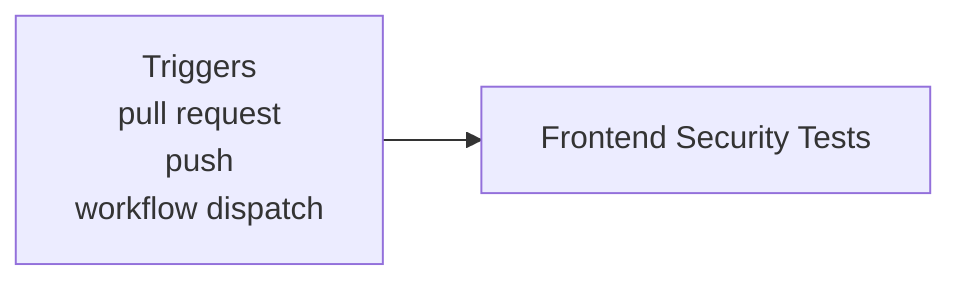
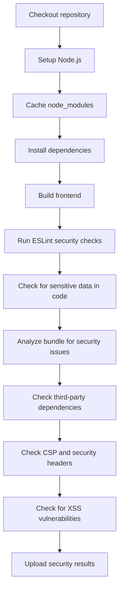

**Security - Frontend Analysis**

**What It Does**

- This workflow helps automate checks for security - frontend analysis. It runs on specific events and performs a series of steps to validate or analyze your application. You can run it manually from GitHub when needed.

**When It Runs**

- On pull request
- On push (branches: main)
- Manually from GitHub (Run workflow)

**Visual Overview**

**Jobs & Steps**

- Job: Frontend Security Tests
  - Runner: ubuntu-latest
  - Depends on: None
  - Artifacts: frontend-security-results-${{ github.run_number }}
  - What happens:
    - Checkout repository
    - Setup Node.js
    - Cache node_modules
    - Install dependencies
    - Build frontend
    - Run ESLint security checks
    - Check for sensitive data in code
    - Analyze bundle for security issues
    - Check third-party dependencies
    - Check CSP and security headers
    - Check for XSS vulnerabilities
    - Upload security results

**Step Diagrams**
**Frontend Security Tests — Steps**

**Required Secrets**

- None

**How To Run Manually**

- Go to your repository on GitHub
- Click the Actions tab
- Select "Security - Frontend Analysis" from the left sidebar
- Click the Run workflow button and follow prompts

**Where To See Results**

- Action run summary shows job status and logs
- Artifacts section provides downloadable reports (if any)
- Annotations highlight warnings and errors in code

**Troubleshooting Tips**

- If a step fails, open the step log to see details
- Ensure required secrets exist under Settings > Secrets and variables > Actions
- Check that referenced paths and scripts exist in the repo
