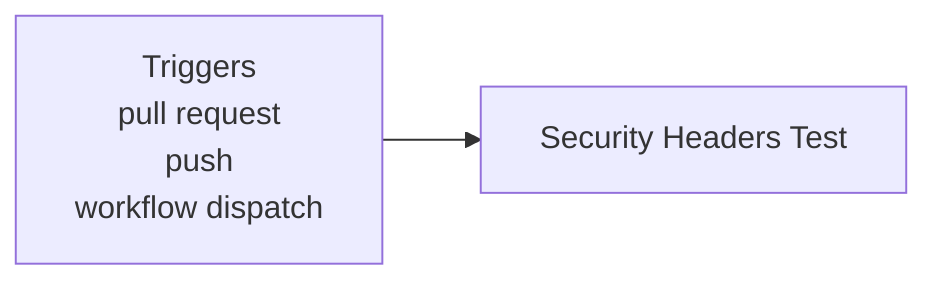
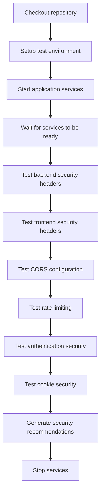

**Security - Headers & Configuration**

**What It Does**

- This workflow helps automate checks for security - headers & configuration. It runs on specific events and performs a series of steps to validate or analyze your application. You can run it manually from GitHub when needed.

**When It Runs**

- On pull request (branches: main, develop)
- On push (branches: main)
- Manually from GitHub (Run workflow)

**Visual Overview**

**Jobs & Steps**

- Job: Security Headers Test
  - Runner: ubuntu-latest
  - Depends on: None
  - What happens:
    - Checkout repository
    - Setup test environment
    - Start application services
    - Wait for services to be ready
    - Test backend security headers
    - Test frontend security headers
    - Test CORS configuration
    - Test rate limiting
    - Test authentication security
    - Test cookie security
    - Generate security recommendations
    - Stop services

**Step Diagrams**
**Security Headers Test — Steps**

**Required Secrets**

- None

**How To Run Manually**

- Go to your repository on GitHub
- Click the Actions tab
- Select "Security - Headers & Configuration" from the left sidebar
- Click the Run workflow button and follow prompts

**Where To See Results**

- Action run summary shows job status and logs
- Artifacts section provides downloadable reports (if any)
- Annotations highlight warnings and errors in code

**Troubleshooting Tips**

- If a step fails, open the step log to see details
- Ensure required secrets exist under Settings > Secrets and variables > Actions
- Check that referenced paths and scripts exist in the repo
