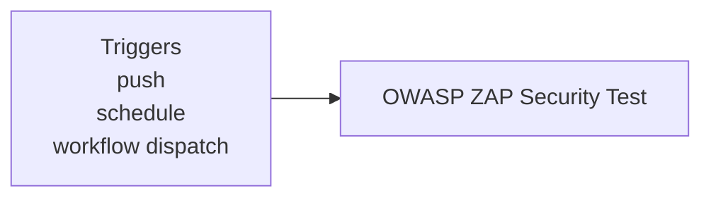

**Security - OWASP ZAP Scan**

**What It Does**

- This workflow helps automate checks for security - owasp zap scan. It runs on specific events and performs a series of steps to validate or analyze your application. You can run it manually from GitHub when needed.

**When It Runs**

- On push (branches: main)
- On schedule (cron: 0 4 \* \* 1)
- Manually from GitHub (Run workflow)

**Visual Overview**



**Jobs & Steps**

- Job: OWASP ZAP Security Test
  - Runner: ubuntu-latest
  - Depends on: None
  - Artifacts: owasp-zap-results-${{ github.run_number }}
  - What happens:
    - Checkout repository
    - Create ZAP rules configuration
    - Setup application environment
    - Start application services
    - Wait for application to be ready
    - Run OWASP ZAP Baseline Scan (Frontend)
    - Run OWASP ZAP API Scan (Backend)
    - Parse ZAP results
    - Upload ZAP results
    - Stop services

**Step Diagrams**
**OWASP ZAP Security Test — Steps**

```mermaid
flowchart TB
  S_owasp_zap_0[Checkout repository]
  S_owasp_zap_1[Create ZAP rules configuration]
  S_owasp_zap_0 --> S_owasp_zap_1
  S_owasp_zap_2[Setup application environment]
  S_owasp_zap_1 --> S_owasp_zap_2
  S_owasp_zap_3[Start application services]
  S_owasp_zap_2 --> S_owasp_zap_3
  S_owasp_zap_4[Wait for application to be ready]
  S_owasp_zap_3 --> S_owasp_zap_4
  S_owasp_zap_5[Run OWASP ZAP Baseline Scan (Frontend)]
  S_owasp_zap_4 --> S_owasp_zap_5
  S_owasp_zap_6[Run OWASP ZAP API Scan (Backend)]
  S_owasp_zap_5 --> S_owasp_zap_6
  S_owasp_zap_7[Parse ZAP results]
  S_owasp_zap_6 --> S_owasp_zap_7
  S_owasp_zap_8[Upload ZAP results]
  S_owasp_zap_7 --> S_owasp_zap_8
  S_owasp_zap_9[Stop services]
  S_owasp_zap_8 --> S_owasp_zap_9
```

**Required Secrets**

- None

**How To Run Manually**

- Go to your repository on GitHub
- Click the Actions tab
- Select "Security - OWASP ZAP Scan" from the left sidebar
- Click the Run workflow button and follow prompts

**Where To See Results**

- Action run summary shows job status and logs
- Artifacts section provides downloadable reports (if any)
- Annotations highlight warnings and errors in code

**Troubleshooting Tips**

- If a step fails, open the step log to see details
- Ensure required secrets exist under Settings > Secrets and variables > Actions
- Check that referenced paths and scripts exist in the repo
