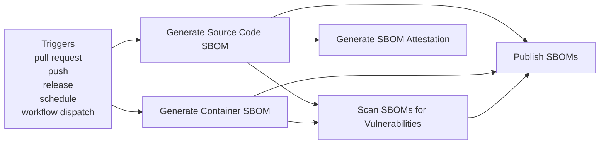
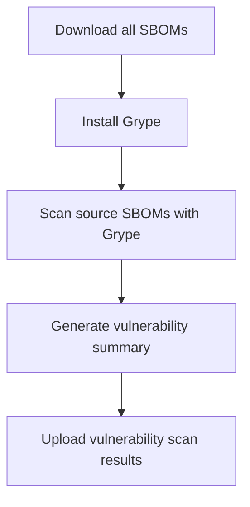
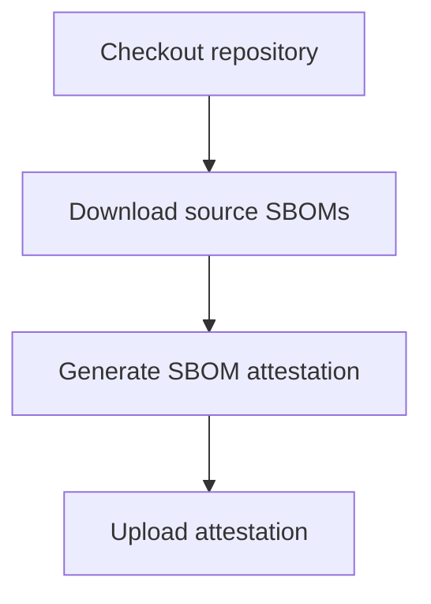
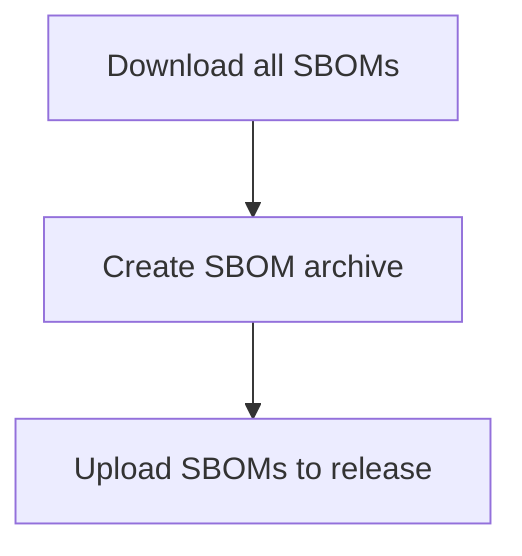

**Security - SBOM Generation**

**What It Does**

- This workflow helps automate checks for security - sbom generation. It runs on specific events and performs a series of steps to validate or analyze your application. You can run it manually from GitHub when needed.

**When It Runs**

- On pull request (branches: main, develop)
- On push (branches: main)
- On release
- On schedule (cron: 0 2 \* \* 1)
- Manually from GitHub (Run workflow)

**Visual Overview**



**Jobs & Steps**

- Job: Generate Source Code SBOM
  - Runner: ubuntu-latest
  - Depends on: None
  - Artifacts: sbom-source-${{ github.run_number }}
  - What happens:
    - Checkout repository
    - Setup Node.js
    - Install Syft
    - Check Node version for cdxgen
    - Generate Frontend SBOM with Syft
    - Generate Backend SBOM with Syft
    - Install cdxgen (if compatible)
    - Generate CycloneDX SBOM with cdxgen
    - Alternative CycloneDX generation with npm
    - Generate npm dependency tree
    - Analyze licenses
    - Generate SBOM summary
    - Upload source SBOMs
- Job: Generate Container SBOM
  - Runner: ubuntu-latest
  - Depends on: None
  - Artifacts: sbom-container-${{ matrix.service }}-${{ github.run_number }}
  - What happens:
    - Checkout repository
    - Set up Docker Buildx
    - Build Docker image (${{ matrix.service }})
    - Install Syft
    - Generate container SBOM with Syft
    - Generate container layer analysis
    - Upload container SBOMs
- Job: Scan SBOMs for Vulnerabilities
  - Runner: ubuntu-latest
  - Depends on: Sbom Source, Sbom Containers
  - Artifacts: sbom-vulnerabilities-${{ github.run_number }}
  - What happens:
    - Download all SBOMs
    - Install Grype
    - Scan source SBOMs with Grype
    - Generate vulnerability summary
    - Upload vulnerability scan results
- Job: Generate SBOM Attestation
  - Runner: ubuntu-latest
  - Depends on: Sbom Source
  - Artifacts: sbom-attestation-${{ github.run_number }}
  - What happens:
    - Checkout repository
    - Download source SBOMs
    - Generate SBOM attestation
    - Upload attestation
- Job: Publish SBOMs
  - Runner: ubuntu-latest
  - Depends on: Sbom Source, Sbom Containers, Sbom Vulnerability Scan
  - What happens:
    - Download all SBOMs
    - Create SBOM archive
    - Upload SBOMs to release

**Step Diagrams**
**Generate Source Code SBOM — Steps**

```mermaid
flowchart TB
  S_sbom_source_0[Checkout repository]
  S_sbom_source_1[Setup Node.js]
  S_sbom_source_0 --> S_sbom_source_1
  S_sbom_source_2[Install Syft]
  S_sbom_source_1 --> S_sbom_source_2
  S_sbom_source_3[Check Node version for cdxgen]
  S_sbom_source_2 --> S_sbom_source_3
  S_sbom_source_4[Generate Frontend SBOM with Syft]
  S_sbom_source_3 --> S_sbom_source_4
  S_sbom_source_5[Generate Backend SBOM with Syft]
  S_sbom_source_4 --> S_sbom_source_5
  S_sbom_source_6[Install cdxgen (if compatible)]
  S_sbom_source_5 --> S_sbom_source_6
  S_sbom_source_7[Generate CycloneDX SBOM with cdxgen]
  S_sbom_source_6 --> S_sbom_source_7
  S_sbom_source_8[Alternative CycloneDX generation with npm]
  S_sbom_source_7 --> S_sbom_source_8
  S_sbom_source_9[Generate npm dependency tree]
  S_sbom_source_8 --> S_sbom_source_9
  S_sbom_source_10[Analyze licenses]
  S_sbom_source_9 --> S_sbom_source_10
  S_sbom_source_11[Generate SBOM summary]
  S_sbom_source_10 --> S_sbom_source_11
  S_sbom_source_12[Upload source SBOMs]
  S_sbom_source_11 --> S_sbom_source_12
```

**Generate Container SBOM — Steps**

```mermaid
flowchart TB
  S_sbom_containers_0[Checkout repository]
  S_sbom_containers_1[Set up Docker Buildx]
  S_sbom_containers_0 --> S_sbom_containers_1
  S_sbom_containers_2[Build Docker image (${{ matrix.service }})]
  S_sbom_containers_1 --> S_sbom_containers_2
  S_sbom_containers_3[Install Syft]
  S_sbom_containers_2 --> S_sbom_containers_3
  S_sbom_containers_4[Generate container SBOM with Syft]
  S_sbom_containers_3 --> S_sbom_containers_4
  S_sbom_containers_5[Generate container layer analysis]
  S_sbom_containers_4 --> S_sbom_containers_5
  S_sbom_containers_6[Upload container SBOMs]
  S_sbom_containers_5 --> S_sbom_containers_6
```

**Scan SBOMs for Vulnerabilities — Steps**



**Generate SBOM Attestation — Steps**



**Publish SBOMs — Steps**



**Required Secrets**

- None

**How To Run Manually**

- Go to your repository on GitHub
- Click the Actions tab
- Select "Security - SBOM Generation" from the left sidebar
- Click the Run workflow button and follow prompts

**Where To See Results**

- Action run summary shows job status and logs
- Artifacts section provides downloadable reports (if any)
- Annotations highlight warnings and errors in code

**Troubleshooting Tips**

- If a step fails, open the step log to see details
- Ensure required secrets exist under Settings > Secrets and variables > Actions
- Check that referenced paths and scripts exist in the repo
