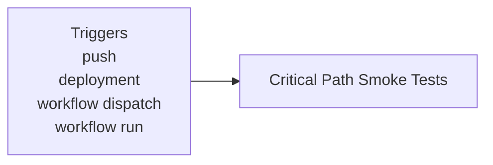
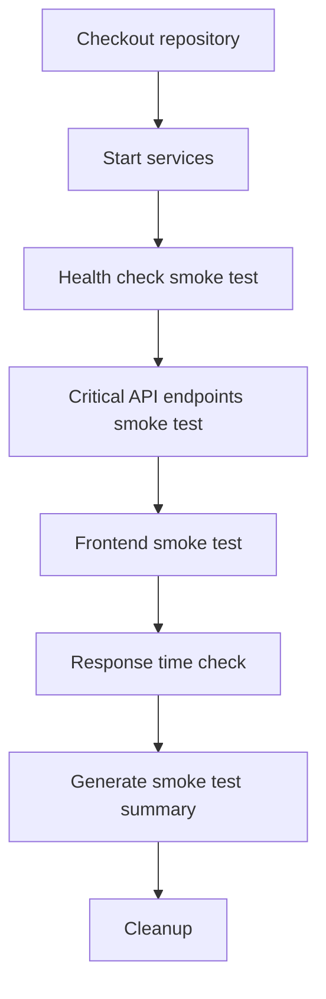

**Smoke Testing**

**What It Does**

- This workflow helps automate checks for smoke testing. It runs on specific events and performs a series of steps to validate or analyze your application. You can run it manually from GitHub when needed.

**When It Runs**

- On push (branches: main)
- On deployment
- Manually from GitHub (Run workflow)
- On workflow_run

**Visual Overview**

**Jobs & Steps**

- Job: Critical Path Smoke Tests
  - Runner: ubuntu-latest
  - Depends on: None
  - What happens:
    - Checkout repository
    - Start services
    - Health check smoke test
    - Critical API endpoints smoke test
    - Frontend smoke test
    - Response time check
    - Generate smoke test summary
    - Cleanup

**Step Diagrams**
**Critical Path Smoke Tests — Steps**

**Required Secrets**

- None

**How To Run Manually**

- Go to your repository on GitHub
- Click the Actions tab
- Select "Smoke Testing" from the left sidebar
- Click the Run workflow button and follow prompts

**Where To See Results**

- Action run summary shows job status and logs
- Artifacts section provides downloadable reports (if any)
- Annotations highlight warnings and errors in code

**Troubleshooting Tips**

- If a step fails, open the step log to see details
- Ensure required secrets exist under Settings > Secrets and variables > Actions
- Check that referenced paths and scripts exist in the repo
